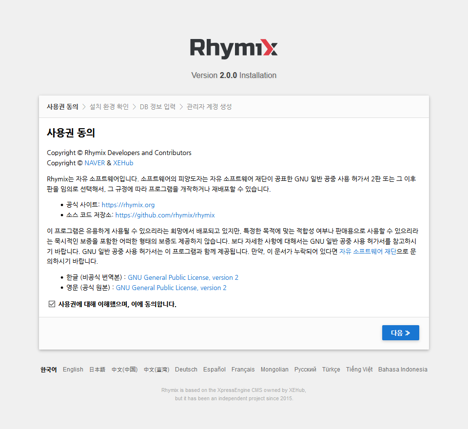
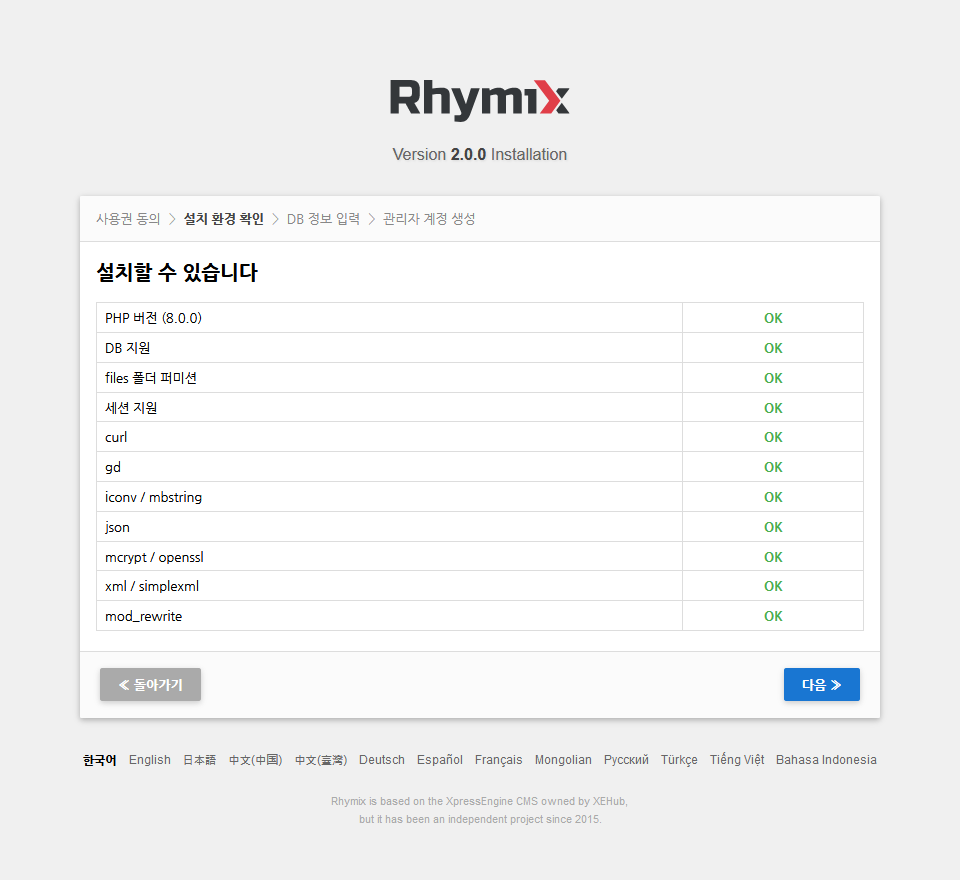
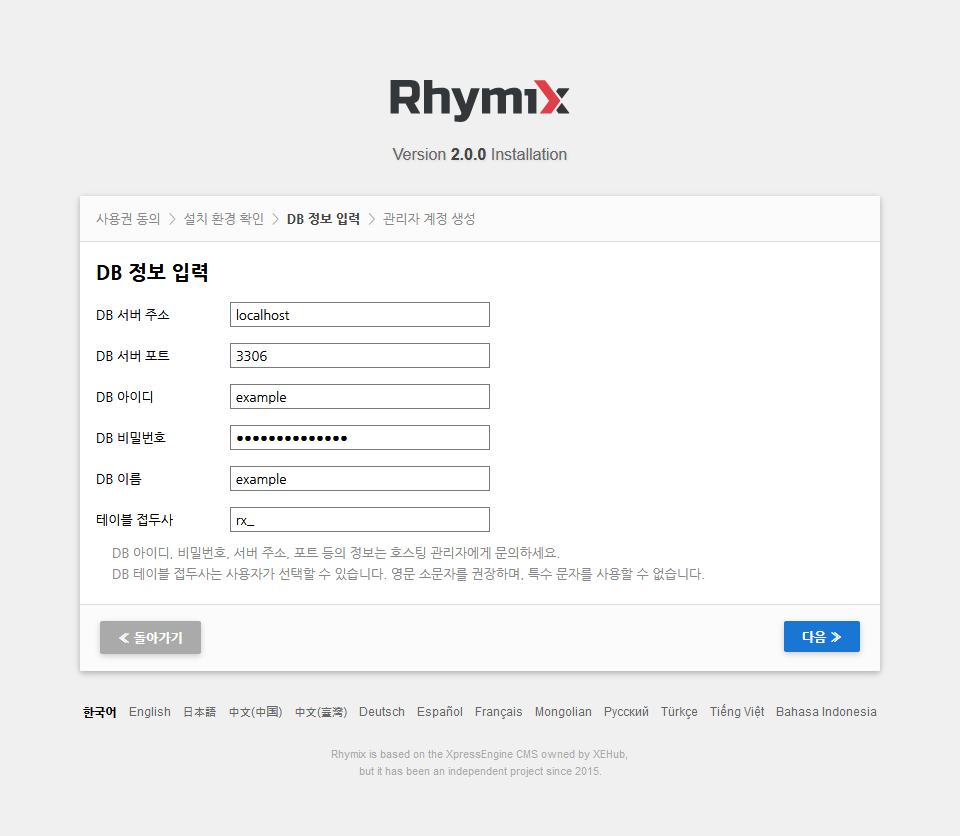
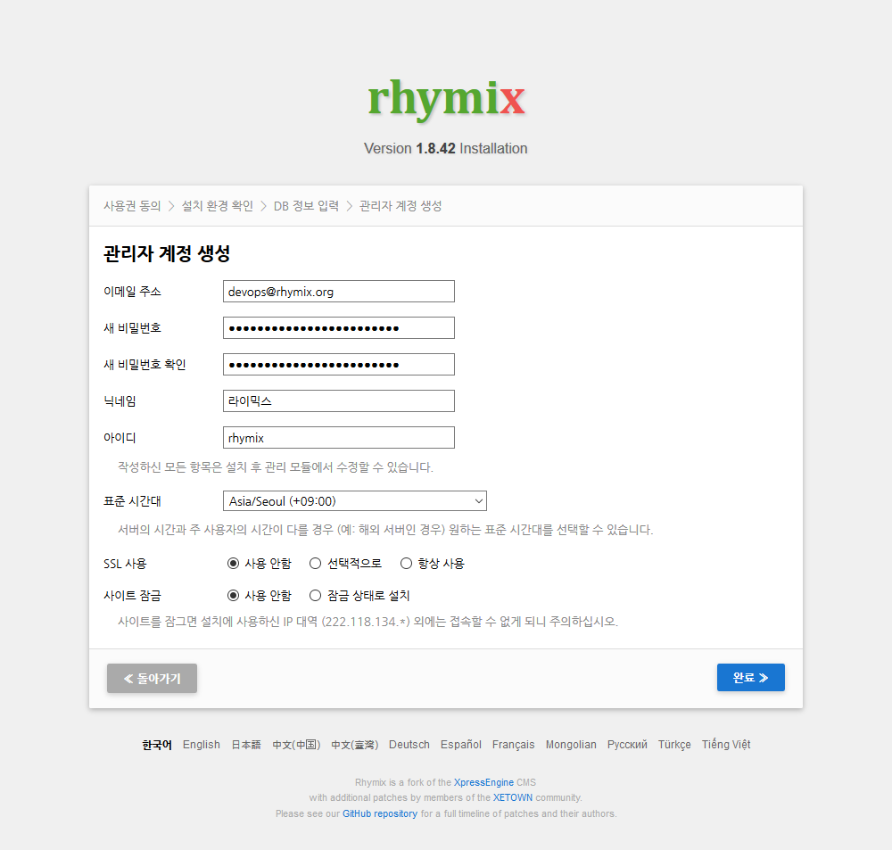

라이믹스 설치
-------------

라이믹스는 PHP로 만들어져 있습니다.
PHP는 국내외 대부분의 웹호스팅 서버에서 간단히 업로드하거나 압축을 풀기만 하면
별도의 서버 설정 없이 곧바로 사용이 가능하다는 장점이 있기 때문에,
전세계적으로 가장 많이 사용되는 CMS들은 대부분 PHP로 만들어져 있습니다.

### 라이믹스 최신 버전 다운로드

라이믹스 GitHub 저장소에서 아래의 두 버전 중 하나를 다운받습니다.

- [master](https://github.com/rhymix/rhymix/archive/master.zip)
- [develop](https://github.com/rhymix/rhymix/archive/develop.zip)

master는 어느 정도 안정화가 이루어진 버전으로, 한 달에 1~2번 업데이트됩니다.
develop는 개발이 활발하게 이루어지고 있는 버전으로, 수시로 업데이트됩니다.
master에서 발생하는 버그가 develop에서 수정되었을 수도 있지만,
반대로 develop에서 새로 생긴 버그가 아직 고쳐지지 않았을 수도 있으므로
develop 사용시에는 수시로 업데이트하실 준비가 되어 있어야 합니다.
원하시는 업데이트 주기에 따라 선택하시기 바랍니다.

파일을 다운받은 후에는 압축을 풀어 FTP 또는 SFTP로 서버에 업로드합니다.
압축파일 그대로 업로드한 후 SSH(터미널)에서 `unzip` 명령으로 압축을 풀어도 됩니다.
단, 서버에서 압축을 풀면 `rhymix-master` 또는 `rhymix-develop` 폴더가 생성되므로
이 폴더의 내용을 상위 폴더로 옮겨주어야 할 수도 있습니다.
이 때 `.htaccess` 등 숨김파일도 모두 옮겨지도록 주의하시기 바랍니다.

FileZilla를 비롯한 대부분의 FTP 프로그램들은 수천 개의 파일을 업로드하면 그 중 일부가 누락될 수 있습니다.
업로드에 실패한 파일이 없는지 반드시 확인하시기 바랍니다.

### git으로 다운로드 (고급/권장)

git으로 라이믹스를 설치하면 수시로 업데이트할 수 있고,
master와 develop을 자유롭게 전환할 수 있다는 장점이 있습니다.
단, 서버에 git이 설치되어 있어야 하며 SSH(터미널) 접속이 가능해야 합니다.

git으로 다운로드하려면 설치를 원하시는 폴더에서 아래와 같은 명령을 내립니다.

    git clone https://github.com/rhymix/rhymix.git

이렇게 하면 `rhymix`라는 폴더가 생성되고, 그 안에 라이믹스가 다운로드됩니다.
`rhymix` 폴더를 원하시지 않는 경우 상위 폴더에서 아래의 명령을 사용하여
`rhymix` 폴더의 내용(숨김파일 포함)을 모두 상위 폴더로 옮겨주시기 바랍니다.

    shopt -s dotglob
	mv rhymix/* .
	shopt -u dotglob

### 퍼미션 조정

라이믹스를 다운로드한 경로에 `files` 폴더를 생성하고, 퍼미션을 777 또는 707로 변경합니다.

    mkdir files
	chmod 777 files

최근에는 웹서버의 PHP 실행 권한이 FTP 계정과 일치하도록 미리 세팅되어 있어
퍼미션 조정이 필요없는 호스팅도 있습니다.

### 설치

라이믹스를 다운로드한 경로를 웹브라우저(크롬, 파이어폭스 등)에서 방문하면
아래와 같은 설치 화면이 나타납니다.
(버전에 따라 디자인이 다를 수 있으나, 기본적인 구조에는 큰 차이가 없을 것입니다.)

GPL 라이선스에 동의하실 경우 "동의"를 선택하고 "다음"을 클릭합니다.

라이믹스를 설치하기 위한 서버 환경이 모두 준비되었는지 확인합니다.
(PHP 버전이 심하게 낮거나 필수 모듈이 누락된 경우 아예 이 화면이 나오지 않고 에러가 발생할 수도 있습니다.)

`mod_rewrite`는 필수가 아니며, 서버에 따라서는 설치 도중 제대로 인식하지 못할 수도 있으므로
`mod_rewrite`가 작동하지 않더라도 설치를 진행할 수 있습니다.
이 경우 설치를 마친 후 관리자 화면에서 "짧은 주소"를 켜시면 됩니다.

모든 항목을 확인하셨으면 "다음"을 클릭합니다.

호스팅 업체에서 부여받은 DB 아이디와 비밀번호 등을 입력합니다.
특별한 경우 외에는 DB 호스트와 포트는 `localhost`, `3306` 그대로 두셔도 됩니다.
테이블 접두사는 `rx` 또는 `xe`를 권장하나, 같은 DB를 함께 쓰는 다른 프로그램이 있는 경우
충돌하지 않도록 다른 접두사를 선택해 주시기 바랍니다.

"다음"을 클릭하면 입력하신 DB 정보를 확인합니다.
DB 아이디와 비밀번호가 틀리거나, 같은 접두사를 쓰는 다른 프로그램이 이미 설치되어 있으면
에러 메시지가 출력되고 위의 화면으로 돌아옵니다.
문제가 없으면 다음 화면으로 진행합니다.

앞으로 사이트 운영에 사용하실 최고관리자 계정을 생성하는 단계입니다.
사용하시는 이메일 주소를 정확하게 입력해 주십시오.
아이디와 비밀번호, 닉네임 등은 자유롭게 정하셔도 됩니다.

표준 시간대는 주 사용자층 또는 관리자가 위치한 국가 또는 지역으로 선택해 주십시오.
대한민국은 `Asia/Seoul`을 권장합니다.

SSL을 지원하는 호스팅에서 설치하시는 경우 처음부터 SSL을 사용하도록 설정하실 수 있으며,
사이트를 꾸미는 동안 타인에게 노출되지 않도록 잠금 설정을 할 수도 있습니다.

관리자 계정 정보를 입력하셨으면 "다음"을 클릭합니다.

**서버 환경에 따라 10~30초가 걸릴 수도 있습니다.**

설치가 완료되면 아래와 같은 초기화면으로 넘어갑니다.
(XEDITION 레이아웃 기준이며, 버전에 따라 디자인이 달라질 수 있습니다.)

우측 상단의 톱니바퀴 아이콘을 클릭하여 관리자 화면으로 들어가시면 됩니다.
